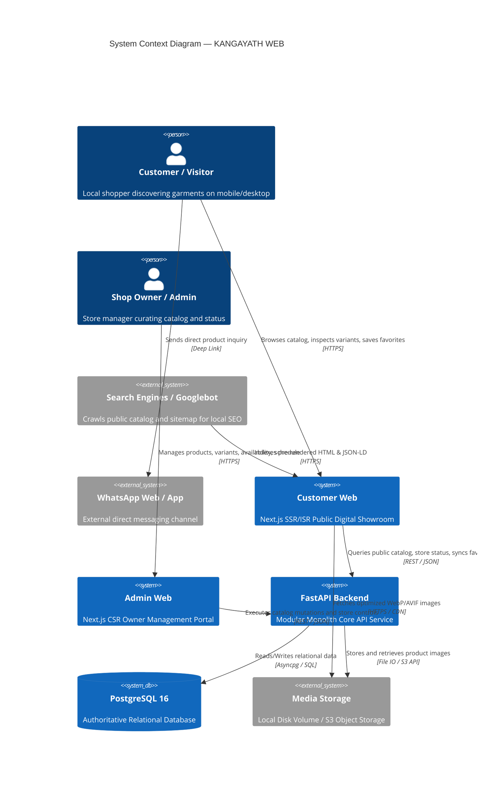
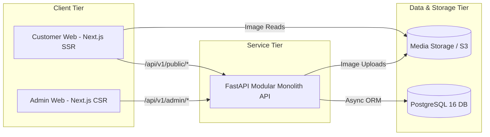
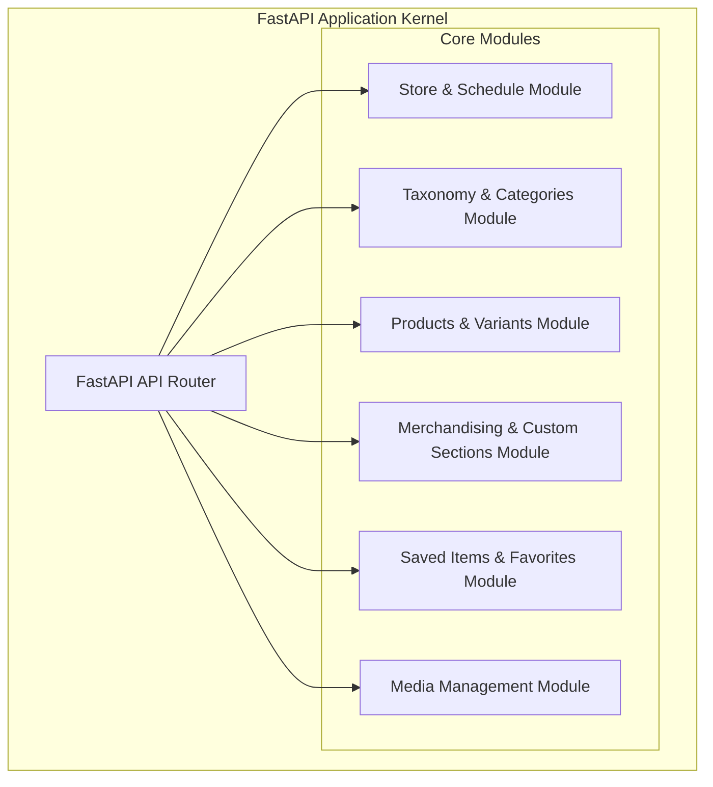
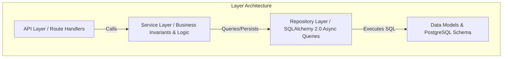
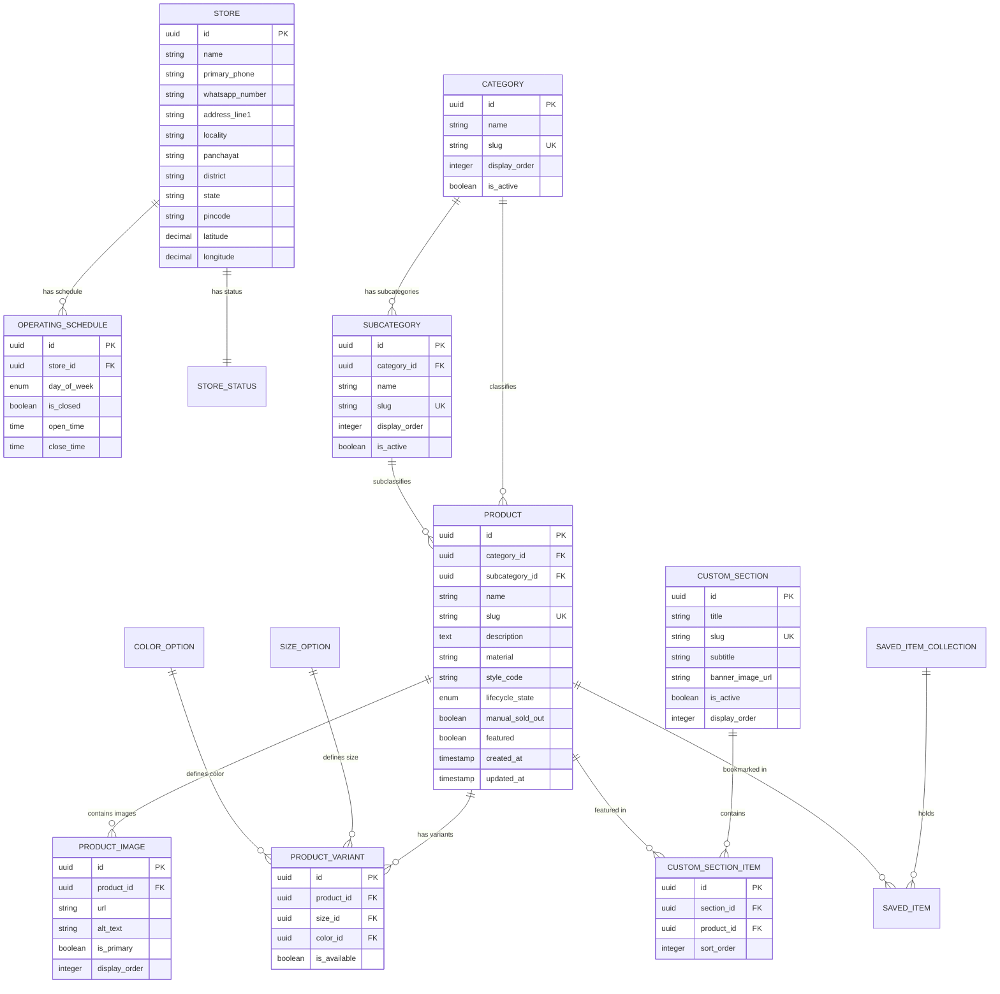
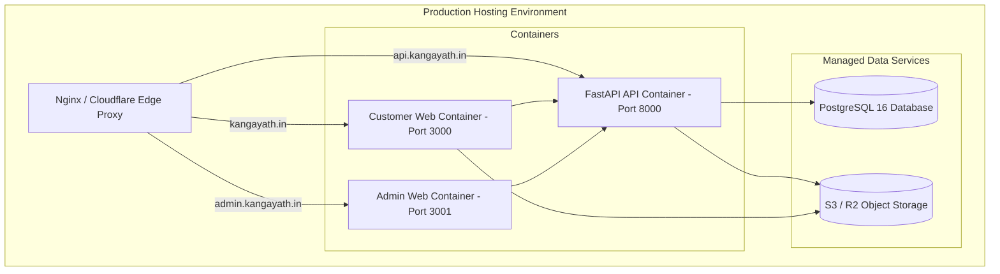
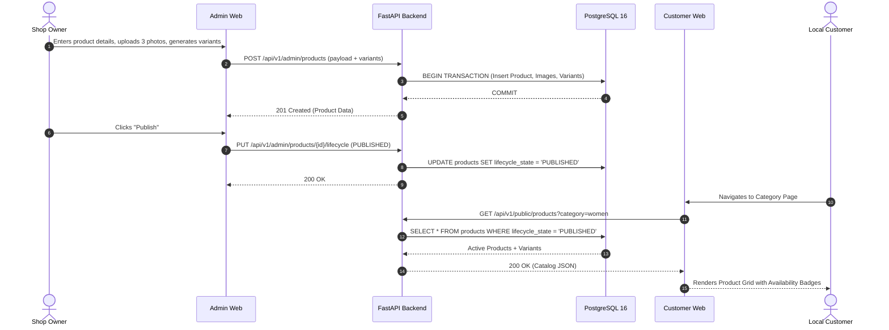
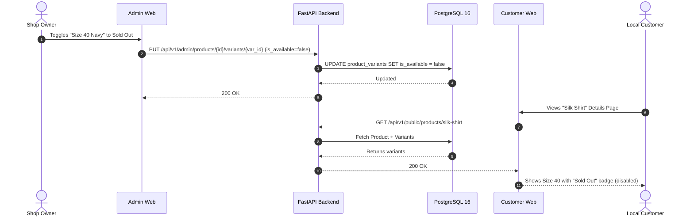
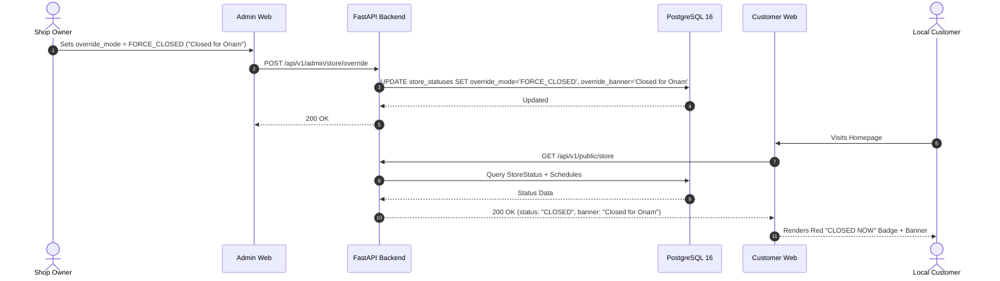

# KANGAYATH WEB — Technical Architecture Specification

**Document Version**: 1.0.0  
**Phase**: Phase 03 — Technical Architecture, System Design & Module Boundaries  
**Authoritative Status**: Final & Approved Baseline  

---

## 1. Executive Summary

### 1.1 Product Architectural Context
**KANGAYATH WEB** is a production-grade digital showroom and product-discovery platform for a physical boutique clothing store. The platform connects local customers in the panchayat region with the physical store by presenting a rich, searchable garment catalog, real-time size and color availability, current shop operating status, and direct WhatsApp communication channels. The final commercial transaction and product delivery occur physically at the retail counter.

### 1.2 Architectural Foundation
- **Dual Frontend Architecture**: Two independent, decoupled frontend applications:
  - `admin-web`: Owner-facing management portal optimized for rapid catalog, availability, and schedule updates.
  - `customer-web`: Public digital showroom optimized for mobile performance, local SEO, and unauthenticated browsing.
- **Modular Monolith Backend**: A unified **FastAPI** application structured into distinct bounded modules (`store`, `taxonomy`, `products`, `merchandising`, `saved_items`, `media`) communicating with a high-performance **PostgreSQL 16** database via asynchronous **SQLAlchemy 2.0**.
- **Deferred Security Boundary**: Explicit, modular architecture allowing Phase 06 authentication (JWT/OAuth2) to integrate seamlessly without altering core domain models or database structures.

### 1.3 Fact / Assumption / Decision Discipline
- **[FACT]**: The system is NOT an e-commerce checkout store (no payment gateway, cart checkout, or shipping logistics).
- **[FACT]**: Authentication/login is intentionally deferred from MVP per explicit client constraint.
- **[DECISION]**: Availability is modeled as boolean `is_available` at the variant level, with an emergency `manual_sold_out` product override.
- **[DECISION]**: Timezone evaluation is canonically anchored to `Asia/Kolkata` (IST, UTC+05:30).
- **[ASSUMPTION]**: Image storage utilizes local persistent Docker volumes in development, switching to S3-compatible object storage for high-scale cloud production.

---

## 2. Architecture Principles

1. **Unidirectional Layering**: Strict downward dependencies: $\text{API (Router)} \to \text{Service (Domain/Logic)} \to \text{Repository (Data Access)} \to \text{PostgreSQL Database}$.
2. **Single Source of Truth**: PostgreSQL is the authoritative system of record; frontends never maintain independent catalog databases.
3. **Explicit Type Safety**: End-to-end typing via Pydantic v2 schemas in Python and TypeScript interfaces in React/Next.js.
4. **Fail-Fast Configuration**: Authoritative Pydantic `BaseSettings` validation on backend startup.
5. **Separation of Runtime Concerns**: Complete deployment and operational independence between the admin portal and the customer showroom.

---

## 3. Project Constraints

1. **No Commercial Checkout**: No payment processing, shopping cart sessions, or order lifecycle pipelines.
2. **Zero Initial Authentication**: Unauthenticated admin and customer browsing in MVP; modular dependency injection ready for Phase 06 authentication.
3. **No Product Price Display**: Prices are omitted from public displays; inquiries are conducted in person or via WhatsApp.
4. **Availability vs. Numeric Counts**: Strict boolean availability per variant; full numeric stock inventory tracking is out of scope.

---

## 4. System Context



---

## 5. High-Level System Architecture

### 5.1 Level 1: System Level


### 5.2 Level 2: Application Level (Backend Bounded Modules)


### 5.3 Level 3: Internal Backend Layering


---

## 6. Architectural Style Decision

### Selected Architecture: **Modular Monolith**
- **Decision**: All domain capabilities (`store`, `taxonomy`, `products`, `merchandising`, `saved_items`, `media`) reside within a single FastAPI codebase, partitioned into isolated Python modules with explicit service and repository interfaces.
- **Rationale**: KANGAYATH is a local physical boutique. A Modular Monolith provides zero network latency for internal module operations, single-transaction ACID guarantees across PostgreSQL tables, simplified local development, and trivial continuous deployment.
- **Rejected Alternatives**:
  - *Microservices*: Rejected due to high operational complexity, distributed transaction overhead, and duplicated infrastructure costs.
  - *Serverless (AWS Lambda)*: Rejected due to cold-start latencies on media operations and database connection pooling constraints.

---

## 7. Frontend Architecture

### 7.1 Customer Web (`customer-web`)
- **Rendering Model**: Hybrid **Server-Side Rendering (SSR)** and **Incremental Static Regeneration (ISR)** via Next.js 15 App Router.
- **Key Modules**:
  - `HomeModule`: Hero banner, active promotional section carousels, current store status badge.
  - `CatalogModule`: Category navigation, subcategory filters, faceted size/color drawer, product grid.
  - `ProductDetailModule`: High-res image gallery, variant availability selector, fabric details, WhatsApp CTA.
  - `SavedItemsModule`: `localStorage` synchronized favorites grid with live availability badges.
  - `StoreInfoModule`: Weekly opening hours, real-time open/closed indicator, Google Maps embed.
- **State Management**: React 19 hooks + lightweight Context API for anonymous saved items.

### 7.2 Admin Web (`admin-web`)
- **Rendering Model**: **Client-Side Rendering (CSR)** with reactive state.
- **Key Modules**:
  - `DashboardModule`: Store status switch, quick summary metrics.
  - `CategoryManager`: 2-level category/subcategory CRUD and display order sorting.
  - `ProductManager`: Product authoring, photo gallery uploader ($\le 6$ images), lifecycle toggle (`Draft`/`Published`).
  - `VariantMatrixManager`: Size/Color matrix generator and 1-click availability toggles.
  - `CustomSectionManager`: Dynamic promotional section creator with drag-and-drop product ordering.
  - `StoreSettingsManager`: Weekly operating hours and manual emergency closure overrides.

---

## 8. Frontend Separation Strategy

| Dimension | `customer-web` | `admin-web` |
| :--- | :--- | :--- |
| **Directory** | `apps/web` (or `apps/customer-web`) | `apps/admin-web` (or dedicated admin route tree) |
| **Primary Rendering** | SSR / ISR (SEO-focused) | CSR (Dashboard-focused) |
| **Target Subdomain** | `kangayath.in` / `www.kangayath.in` | `admin.kangayath.in` |
| **API Namespace** | `/api/v1/public/*` | `/api/v1/admin/*` |
| **Authentication** | Strictly Anonymous | Direct in MVP; JWT / OAuth2 in Phase 06 |
| **Build & Deploy** | Independent CI/CD pipeline | Independent CI/CD pipeline |

---

## 9. Backend Architecture

### 9.1 Directory & Layer Organization
```text
apps/api/app/
├── main.py                     # ASGI Lifecycle & Middleware Aggregation
├── core/
│   ├── config.py               # Pydantic BaseSettings singleton
│   ├── security.py             # Security & Sanitization helpers
│   └── dependencies.py         # FastAPI Dependency Injection (DB session, Auth placeholder)
├── api/
│   └── v1/
│       ├── api.py              # Router Aggregator
│       ├── public/             # Public namespace (/api/v1/public/*)
│       │   ├── store.py
│       │   ├── categories.py
│       │   ├── products.py
│       │   ├── sections.py
│       │   └── saved_items.py
│       └── admin/              # Admin namespace (/api/v1/admin/*)
│           ├── store.py
│           ├── categories.py
│           ├── products.py
│           ├── variants.py
│           ├── sections.py
│           └── media.py
├── modules/                    # Bounded Context Modules
│   ├── store/
│   ├── taxonomy/
│   ├── products/
│   ├── merchandising/
│   ├── saved_items/
│   └── media/
├── models/                     # SQLAlchemy 2.0 Declarative Models
│   ├── base.py
│   ├── store.py
│   ├── taxonomy.py
│   ├── product.py
│   ├── variant.py
│   ├── custom_section.py
│   └── saved_item.py
├── schemas/                    # Pydantic v2 Validation Schemas
└── repositories/               # Async Database Query Layer
```

---

## 10. Domain Boundaries

```text
┌──────────────────────────────┬──────────────────────────────┬──────────────────────────────┐
│       Store Operations       │      Catalog & Taxonomy      │     Products & Inventory     │
├──────────────────────────────┼──────────────────────────────┼──────────────────────────────┤
│ • StoreProfile               │ • Category (Department)      │ • Product (Garment Entity)   │
│ • OperatingHoursSchedule     │ • Subcategory (Garment Type) │ • ProductImage (Gallery)     │
│ • StoreStatus (Real-time)    │ • Display Order & Slugs      │ • ProductVariant (Size+Color)│
│ • Asia/Kolkata Timezone      │ • 2-Level Hierarchy Guard    │ • SizeOption & ColorOption   │
│ • Manual Override Resolver   │ • Referential Deletion Block │ • Boolean Availability       │
├──────────────────────────────┼──────────────────────────────┼──────────────────────────────┤
│        Merchandising         │      Customer Discovery      │       Media & Assets         │
├──────────────────────────────┼──────────────────────────────┼──────────────────────────────┤
│ • CustomSection (Promotions) │ • SavedItemCollection        │ • Upload Validation (<5MB)   │
│ • CustomSectionItem (Join)   │ • SavedItem (Product Ref)    │ • Format Check (JPEG/PNG/WebP│
│ • Explicit Sort Ordering     │ • Anonymous Session Sync     │ • 6-Image Upper Boundary     │
│ • Multi-Section Assignment   │ • Live Status Badging        │ • S3 / Local Disk Storage    │
└──────────────────────────────┴──────────────────────────────┴──────────────────────────────┘
```

---

## 11. API Architecture

### 11.1 Standard REST Conventions
- **Protocol**: HTTP/2 over TLS 1.3 (HTTPS).
- **Format**: JSON (`Content-Type: application/json`).
- **URI Structure**: Lowercase, plural nouns, hyphen-separated slugs (e.g. `/api/v1/public/products/{slug}`).
- **Standard HTTP Codes**:
  - `200 OK`: Successful read/update.
  - `201 Created`: Successful creation.
  - `204 No Content`: Successful deletion.
  - `400 Bad Request`: Validation failure.
  - `404 Not Found`: Entity missing.
  - `409 Conflict`: Unique constraint violation (e.g. duplicate slug or variant).
  - `422 Unprocessable Entity`: Schema validation error.
  - `500 Internal Server Error`: Unhandled server exception.

### 11.2 Error Payload Envelope Standard
```json
{
  "error": {
    "code": "CATEGORY_HAS_ACTIVE_DEPENDENCIES",
    "message": "Cannot delete category while active subcategories or products exist.",
    "details": { "active_subcategories": 3, "active_products": 14 },
    "timestamp": "2026-08-20T10:00:00Z"
  }
}
```

---

## 12. Public vs. Admin API Namespaces

### 12.1 Public API (`/api/v1/public/`)
| Endpoint | Method | Purpose |
| :--- | :--- | :--- |
| `/api/v1/public/store` | `GET` | Retrieve store profile, contacts, hours, and real-time open/closed status. |
| `/api/v1/public/categories` | `GET` | List all active categories and their subcategories. |
| `/api/v1/public/sections` | `GET` | List active promotional sections with featured products. |
| `/api/v1/public/sections/{slug}` | `GET` | Retrieve specific custom section details and paginated products. |
| `/api/v1/public/products` | `GET` | Search and filter published catalog (`category`, `size`, `color`, `available_only`). |
| `/api/v1/public/products/{slug}` | `GET` | Retrieve product details, multi-angle images, and variant availability matrix. |
| `/api/v1/public/saved-items` | `POST` | Retrieve live product availability for an array of saved product IDs. |
| `/api/v1/public/saved-items/sync` | `POST` | Sync anonymous client-side saved items with session token. |

### 12.2 Admin API (`/api/v1/admin/`)
| Endpoint | Method | Purpose |
| :--- | :--- | :--- |
| `/api/v1/admin/store` | `GET`, `PUT` | View and update store profile, address, and coordinates. |
| `/api/v1/admin/store/schedule` | `GET`, `PUT` | Configure weekly operating hours. |
| `/api/v1/admin/store/override` | `POST` | Set manual open/closed emergency override. |
| `/api/v1/admin/categories` | `GET`, `POST`, `PUT`, `DELETE` | CRUD operations for categories. |
| `/api/v1/admin/subcategories` | `GET`, `POST`, `PUT`, `DELETE` | CRUD operations for subcategories. |
| `/api/v1/admin/products` | `GET`, `POST`, `PUT`, `DELETE` | CRUD operations for products and draft state management. |
| `/api/v1/admin/products/{id}/images` | `POST`, `DELETE`, `PUT` | Upload images, delete images, and set primary image. |
| `/api/v1/admin/products/{id}/variants`| `GET`, `POST`, `PUT`, `DELETE` | Generate variant matrix and toggle variant availability. |
| `/api/v1/admin/products/{id}/sold-out`| `PUT` | Toggle master product-level sold-out override. |
| `/api/v1/admin/sections` | `GET`, `POST`, `PUT`, `DELETE` | Manage dynamic promotional sections. |
| `/api/v1/admin/sections/{id}/items` | `PUT` | Curate and reorder products within a promotional section. |
| `/api/v1/admin/attributes/sizes` | `GET`, `POST`, `PUT` | Manage controlled size dictionary. |
| `/api/v1/admin/attributes/colors` | `GET`, `POST`, `PUT` | Manage controlled color dictionary. |

---

## 13. Database Architecture

### 13.1 Relational Schema Blueprint (PostgreSQL 16)


---

## 14. Product Variation Architecture

- **Combinatorial Generation**: Admin selects active sizes (e.g. $[S, M, L]$) and colors (e.g. $[\text{Navy}, \text{Maroon}]$). System generates 6 variant combinations in one atomic transaction.
- **Uniqueness Invariant**: Unique database constraint on `(product_id, size_id, color_id)`.
- **Independent Availability**: Each variant possesses an independent boolean `is_available`.
- **Derived Product Availability**:
  $$\text{Effective Status} = \begin{cases} \text{Sold Out}, & \text{if } \text{Product.manual\_sold\_out} = \text{true} \\ \text{Available}, & \text{if } \exists v \in \text{Variants} : v.\text{is\_available} = \text{true} \\ \text{Sold Out}, & \text{otherwise} \end{cases}$$

---

## 15. Category Architecture

- **2-Level Hierarchy**: Strict Category (Department) $\to$ Subcategory (Garment Type). No recursive sub-subcategories.
- **Referential Integrity**: Foreign keys enforce `ON DELETE RESTRICT`. Deleting a Category with active Subcategories or Products is rejected at the database level.
- **Ordering**: Explicit `display_order` integer field for deterministic navigation rendering.

---

## 16. Custom Section Architecture

- **Generic Schema**: Dynamic `CustomSection` entity supporting any seasonal or promotional campaign without schema migrations.
- **Many-to-Many Association**: A single product can belong to multiple sections via `CustomSectionItem`.
- **Explicit Curation**: `CustomSectionItem.sort_order` allows manual drag-and-drop sequencing.
- **Deactivation Safety**: Disabling a section hides the section carousel while preserving product associations in the database.

---

## 17. Media Architecture

- **Constraints**: Maximum 6 images per product; maximum 5MB per upload; formats restricted to JPEG, PNG, WebP.
- **Primary Image Rule**: Exactly one image per product must have `is_primary = true`.
- **Storage Strategy**: Abstract `MediaStorageService` writes to `/uploads` in local development and S3/R2 in production.
- **Next.js Delivery**: `next/image` performs automated server-side WebP/AVIF transcoding and responsive downscaling.

---

## 18. Search and Filtering Architecture

- **Search Capabilities**: Keyword search across `Product.name`, `Product.description`, `Product.material`, and `Product.style_code` using PostgreSQL ILIKE / Trigram indexes (`pg_trgm`).
- **Faceted Filters**: Compound filtering by Category, Subcategory, Size, Color, Custom Section, and Availability status.
- **Index Optimization**:
  - `idx_products_lifecycle_cat_sub`: Composite index on `(lifecycle_state, category_id, subcategory_id)`.
  - `idx_variants_avail_prod`: Composite index on `(product_id, is_available)`.
  - `idx_products_slug`: Unique index on `products.slug`.

---

## 19. Caching Strategy

- **HTTP Cache-Control**: Public catalog endpoints return `Cache-Control: public, max-age=60, s-maxage=300, stale-while-revalidate=600`.
- **Next.js ISR**: Public product and category pages use Incremental Static Regeneration (`revalidate = 300`).
- **Cache Invalidation**: Admin mutations send on-demand Next.js revalidation webhook calls (`revalidatePath`) to refresh modified pages instantly.

---

## 20. Consistency Model

- **Transactional Model**: Strong ACID consistency in PostgreSQL for all catalog mutations and availability updates.
- **Atomic Operations**: Product creation, image association, and variant generation execute in a single database transaction.
- **Eventual Consistency**: Public HTTP caches and ISR pages update within seconds upon admin mutation via revalidation webhooks.

---

## 21. Concurrency and Integrity

- **Optimistic Concurrency**: Timestamp-based validation (`updated_at`) prevents accidental overwrite during simultaneous admin sessions.
- **Unique Constraints**: Database-level unique constraints prevent duplicate slugs, duplicate variant combinations, and duplicate custom section assignments.

---

## 22. Error Handling Architecture

- **FastAPI Exception Handlers**: Global exception handlers catch domain exceptions (`EntityNotFoundException`, `InvariantViolationException`, `DuplicateResourceException`) and serialize them into standard error envelopes.
- **Error Sanitization**: Internal database stack traces and query strings are never returned in HTTP error responses.

---

## 23. Security Architecture

### 23.1 Development State (Current MVP)
- Admin endpoints are accessible without login to satisfy the rapid client validation constraint.
- Log sanitization masks sensitive data attributes.
- CORS strictly permits configured local origins (`http://localhost:3000`, `http://127.0.0.1:3000`).

### 23.2 Target State (Phase 06 Auth Boundary)
- Admin routes will be protected by injecting `Depends(get_current_admin_user)` which validates JWT Bearer tokens or secure HttpOnly session cookies.
- Domain services and database repositories require zero refactoring when authentication is activated.

---

## 24. SEO Architecture

- **Dynamic Metadata**: Next.js `generateMetadata()` dynamically populates `<title>`, `<meta name="description">`, `<link rel="canonical">`, and Open Graph tags.
- **Structured JSON-LD Data**: Pre-rendered `ClothingStore` schema on the homepage and `Product` schema on product detail pages.
- **Automated Sitemap & Robots**: Next.js App Router dynamically generates `/sitemap.xml` and `/robots.txt`.

---

## 25. Observability

- **Structured JSON Logging**: Standard Python logging outputting JSON log entries with timestamp, log level, module name, and request ID.
- **Health Probes**:
  - `/health`: Liveness probe for container orchestrators.
  - `/api/v1/health`: Readiness probe checking PostgreSQL connection and configuration health.

---

## 26. Configuration Management

- **Centralized Settings**: Pydantic `BaseSettings` singleton in `app/core/config.py`.
- **Environment Tiers**: Multi-tier configuration files (`.env.development`, `.env.test`, `.env.production`).
- **Zero Secrets**: Secrets are loaded exclusively from environment variables and never committed to Git.

---

## 27. Deployment Architecture



---

## 28. Domain and URL Strategy

- **Customer Website**: `https://kangayath.in` (or `https://www.kangayath.in`)
- **Admin Portal**: `https://admin.kangayath.in`
- **Backend API**: `https://api.kangayath.in`
- **Benefits**: Complete domain isolation, clean cookie scoping, independent SSL certificates, and zero route collisions.

---

## 29. Testing Architecture

- **Backend Testing**: `pytest` + `pytest-asyncio` + `httpx.AsyncClient` covering unit logic, repository queries, and REST endpoints.
- **Frontend Testing**: `vitest` + `@testing-library/react` covering component rendering, user interactions, and smoke tests.
- **End-to-End Testing**: Playwright test suite validating critical user flows across customer and admin portals.

---

## 30. CI/CD Architecture

- **GitHub Actions Pipelines**:
  - `ci-backend.yml`: Ruff lint & format check, Mypy strict typecheck, Pytest suite with coverage.
  - `ci-frontend.yml`: ESLint, TypeScript typecheck, Vitest suite, Next.js production build.
  - `docker-build.yml`: Container image building and vulnerability scanning.

---

## 31. Failure and Recovery

| Failure Mode | Detection | System Behavior | Recovery Action |
| :--- | :--- | :--- | :--- |
| **PostgreSQL Down** | `/api/v1/health` fails | API returns `503 Service Unavailable`; Customer Web serves cached ISR pages | Container restart / managed DB automatic failover |
| **Media Storage Down** | Image 404 error | Customer Web renders placeholder fallback SVG | S3 replica fallback |
| **Invalid Admin Input** | Pydantic validation error | API returns `422 Unprocessable Entity`; state unchanged | Admin corrects form fields |

---

## 32. Performance Targets

- **API Response Latency**: Public catalog queries $p95 < 150\text{ms}$.
- **Customer Frontend Web Vitals**:
  - First Contentful Paint (FCP) $< 1.2\text{s}$ (4G Mobile).
  - Largest Contentful Paint (LCP) $< 2.0\text{s}$ (4G Mobile).
  - Cumulative Layout Shift (CLS) $< 0.1$.

---

## 33. Accessibility Standards

- **WCAG 2.1 AA Compliance**: All text elements meet $\ge 4.5:1$ contrast ratio.
- **Keyboard Navigation**: Complete tab-order focus management across modals, drawers, and variant selectors.
- **Screen Reader Support**: Semantic HTML5 elements and meaningful image alt text.

---

## 34. Maintainability & Code Quality

- **Zero Technical Debt Policy**: Strict linting (Ruff / ESLint), strict typing (Mypy / TypeScript `strict: true`), and mandatory test coverage on new services.
- **Modular Boundaries**: Modules communicate via explicit interfaces; circular dependencies are forbidden.

---

## 35. Future Extensibility Analysis

| Future Feature | Architectural Compatibility | Strategy |
| :--- | :--- | :--- |
| **Phase 06 Admin Authentication** | **Naturally Supported** | Swap `get_current_admin_user` dependency to validate JWT/OAuth2. |
| **POS Barcode Scanner Sync** | **Naturally Supported** | Add `/api/v1/admin/inventory/barcode-scan` endpoint updating `ProductVariant.is_available`. |
| **Online E-Commerce Checkout** | **Module Addition** | Introduce new `orders` and `payments` bounded modules without altering core catalog. |
| **Multilingual UI (Tamil/Malayalam)**| **Naturally Supported** | Next.js i18n routing + localized database content columns. |

---

## 36. Architecture Decision Records Index

- [ADR-0001: Monorepo Organization](../decisions/ADR-0001-monorepo-structure.md)
- [ADR-0002: Backend FastAPI Stack](../decisions/ADR-0002-backend-fastapi-stack.md)
- [ADR-0003: Frontend Next.js Stack](../decisions/ADR-0003-frontend-nextjs-stack.md)
- [ADR-0004: Configuration Governance & Secrets](../decisions/ADR-0004-configuration-and-secrets.md)
- [ADR-0005: Multi-Tiered Testing Strategy](../decisions/ADR-0005-testing-strategy.md)
- [ADR-0006: Modular Monolith Backend](../decisions/ADR-0006-modular-monolith-backend.md)
- [ADR-0007: Public vs Admin API Separation](../decisions/ADR-0007-public-vs-admin-api-separation.md)
- [ADR-0008: Variation-Based Inventory Model](../decisions/ADR-0008-variation-based-inventory-model.md)
- [ADR-0009: Generic Dynamic Custom Section Model](../decisions/ADR-0009-generic-custom-collection-model.md)
- [ADR-0010: Deferred Authentication Boundary](../decisions/ADR-0010-deferred-authentication-boundary.md)
- [ADR-0011: Customer SSR/ISR Rendering Strategy](../decisions/ADR-0011-customer-ssr-isr-rendering-strategy.md)
- [ADR-0012: Media Storage and Optimization Pipeline](../decisions/ADR-0012-media-storage-and-optimization-pipeline.md)

---

## 37. Architecture Diagrams Catalog

### 37.1 Product Data Flow (Creation to Discovery)


### 37.2 Variant Availability Toggle & Customer Reflection


### 37.3 Shop Open/Closed Schedule & Override Flow


---

## 38. Repository Structure

```text
kangayath-web/
├── apps/
│   ├── api/                     # FastAPI Backend (Python 3.12)
│   ├── web/                     # Customer Showroom Frontend (Next.js 15 SSR)
│   └── admin-web/               # Admin Management Portal (Next.js 15 CSR)
├── packages/
│   └── shared-types/            # Shared TypeScript API Contracts & Type Definitions
├── infrastructure/
│   └── docker/                  # Docker Compose & PostgreSQL init scripts
├── docs/                        # Comprehensive Architecture & Requirements Specs
└── scripts/                     # Developer startup and unified test runners
```

---

## 39. Shared Contract Strategy

- **OpenAPI Schema Export**: FastAPI automatically generates compliant OpenAPI 3.1 JSON at `/api/v1/openapi.json`.
- **TypeScript Generation**: Automated script generates type-safe TypeScript definitions (`packages/shared-types`) directly from OpenAPI schemas, eliminating contract drift between backend and frontends.

---

## 40. Versioning and Migration

- **API Versioning**: URL-path versioning (`/api/v1/*`).
- **Database Migrations**: Managed exclusively via **Alembic**. All migrations are linear, revision-tracked, and tested in CI before production deployment.

---

## 41. Documentation Architecture

```text
docs/
├── GOVERNANCE.md                # Engineering Constitution & DoD
├── architecture/
│   ├── technical_architecture.md# Master Architecture Specification
│   └── overview.md              # System Architecture Overview
├── decisions/                   # Architecture Decision Records (ADR-0001 to ADR-0012)
├── requirements/                # PRD, Domain Spec, Workflows, User Stories, Traceability
├── development/                 # Onboarding & Workflows
├── security/                    # Security Baseline & Controls
├── testing/                     # Multi-Tiered Testing Strategy
└── operations/                  # Operational Runbook & Docker Management
```

---

## 42. Architectural Risk Matrix

| Risk ID | Risk Description | Severity | Mitigation Strategy | Residual Risk |
| :--- | :--- | :--- | :--- | :--- |
| **RSK-001** | Unauthenticated Admin API in MVP | **MEDIUM** | Isolate to local/VPN network; modular `get_current_admin_user` dependency ready for Phase 06 auth. | LOW (when isolated) |
| **RSK-002** | Timezone Skew on Store Status | **LOW** | Hardcoded canonical `Asia/Kolkata` calculation on backend. | NEGLIGIBLE |
| **RSK-003** | Stale Catalog Cache on Customer Web | **LOW** | Next.js On-Demand Revalidation webhooks on admin mutations. | LOW |
| **RSK-004** | Disk Full from Image Uploads | **LOW** | Strict 5MB limit and max 6 images per product; abstract S3 adapter ready for cloud offloading. | LOW |

---

## 43. Non-Functional Requirements Summary

| Category | Specification | Verification Method |
| :--- | :--- | :--- |
| **Performance** | API $p95 < 150\text{ms}$, Mobile LCP $< 2.0\text{s}$ | Load testing & Lighthouse audits |
| **Availability** | $99.9\%$ uptime during physical store hours (9:30 AM – 9:00 PM IST) | Health probe monitoring |
| **Scalability** | Capable of serving 10,000 daily catalog views on single VPS instance | Container load tests |
| **Accessibility** | WCAG 2.1 AA Compliance, complete keyboard navigability | Automated axe-core audits |

---

## 44. MVP vs. Future Scope Alignment

```text
┌───────────────────────────────────────────────────┬───────────────────────────────────────────────────┐
│              MVP / PHASE 03 REQUIRED              │              FUTURE CAPABILITIES                  │
├───────────────────────────────────────────────────┼───────────────────────────────────────────────────┤
│ • 2-level Category/Subcategory taxonomy           │ • Phase 06 Admin JWT / OAuth2 Authentication      │
│ • Product authoring & 6-image gallery             │ • Automated Barcode POS scanner synchronization   │
│ • Size/Color variant matrix with boolean stock    │ • Customer user accounts & cloud-synced wishlists │
│ • 1-click product-level sold-out override         │ • Multilingual UI (Malayalam / Tamil)             │
│ • Dynamic promotional custom sections             │ • Direct E-commerce checkout & delivery logistics │
│ • Operating schedule & real-time IST shop status  │                                                   │
│ • Anonymous localStorage saved items + sync       │                                                   │
│ • One-click WhatsApp inquiry & Google Maps links  │                                                   │
│ • Local SEO (JSON-LD & Open Graph pre-rendering)  │                                                   │
└───────────────────────────────────────────────────┴───────────────────────────────────────────────────┘
```

---

## 45. Traceability Matrix

| Requirement ID | Architectural Component | API Namespace | Database Entity | Frontend Application |
| :--- | :--- | :--- | :--- | :--- |
| **FR-001 – FR-006** | Store Operations Module | `/api/v1/public/store`, `/api/v1/admin/store` | `StoreProfile`, `OperatingSchedule`, `StoreStatus` | `customer-web`, `admin-web` |
| **FR-007 – FR-011** | Taxonomy Module | `/api/v1/public/categories`, `/api/v1/admin/categories` | `Category`, `Subcategory` | `customer-web`, `admin-web` |
| **FR-012 – FR-015** | Product Core Module | `/api/v1/public/products`, `/api/v1/admin/products` | `Product`, `ProductImage` | `customer-web`, `admin-web` |
| **FR-016 – FR-022** | Product Variant Module | `/api/v1/admin/products/{id}/variants` | `ProductVariant`, `SizeOption`, `ColorOption` | `customer-web`, `admin-web` |
| **FR-023 – FR-026** | Merchandising Module | `/api/v1/public/sections`, `/api/v1/admin/sections` | `CustomSection`, `CustomSectionItem` | `customer-web`, `admin-web` |
| **FR-027 – FR-031** | Search & Discovery Module | `/api/v1/public/products` | `Product`, `ProductVariant` (Trigram Index) | `customer-web` |
| **FR-032 – FR-035** | Customer Engagement Module | `/api/v1/public/saved-items` | `SavedItemCollection`, `SavedItem` | `customer-web` |

---

## 46. Phase-04 Readiness Gate

Phase 03 provides the exact relational schema definitions, foreign key rules, indexing strategies, and lifecycle states required for **Phase 04 — Database & Data Layer**.

Phase 04 is authorized to directly generate:
1. **PostgreSQL Relational Schema & DDL**:
   - `stores`, `operating_schedules`, `store_statuses`
   - `categories`, `subcategories` (with `ON DELETE RESTRICT`)
   - `products`, `product_images` ($\le 6$, cascade delete), `product_variants` (unique size/color, cascade delete)
   - `size_options`, `color_options`
   - `custom_sections`, `custom_section_items` (many-to-many with sort order)
   - `saved_item_collections`, `saved_items` (anonymous session tokens)
2. **SQLAlchemy 2.0 Async Models**: Declarative mapping matching the exact architectural types and relationships.
3. **Alembic Initial Migration Baseline**: Migration script generating all tables, foreign keys, unique constraints, and composite indexes.
