# Database & Data Architecture Specification — KANGAYATH WEB

**Document Version**: 1.0.0  
**Phase**: Phase 04 — Database & Data Layer  
**Status**: Authoritative Reference  

---

## 1. Executive Summary & Data Principles

### 1.1 Purpose
This document specifies the complete, normalized, and migration-safe relational database architecture for **KANGAYATH WEB** on **PostgreSQL 16**. It defines all tables, columns, data types, constraints, foreign key cascade behaviors, indexes, and transaction boundaries supporting the FastAPI backend and dual frontends.

### 1.2 Core Data Modeling Principles
1. **Third Normal Form (3NF)**: Strict relational normalization; zero comma-separated strings or redundant denormalized attribute columns.
2. **True Variant-Level Modeling**: Full combinatorial separation: $\text{Product} \to \text{ProductVariant} \to \text{SizeOption} / \text{ColorOption}$, supporting independent boolean availability states.
3. **Referential Integrity Guards**: `ON DELETE RESTRICT` on categories/subcategories to prevent accidental orphan trees; `ON DELETE CASCADE` for tightly owned children (images, variants, section items).
4. **Timezone Standardization**: All persisted timestamps (`created_at`, `updated_at`, `override_until`) are stored in **UTC** with explicit timezone awareness (`TIMESTAMPTZ`). Real-time store schedule comparisons convert to canonical `Asia/Kolkata` (IST).
5. **UUID Primary Keys**: Uniform `UUIDv4` primary keys generated via PostgreSQL `uuid-ossp` / `gen_random_uuid()` or Python `uuid.uuid4`.

---

## 2. Entity Relationship Diagram (ERD)

```mermaid
erDiagram
    STORE_PROFILE ||--o{ OPERATING_SCHEDULE : "has weekly schedule"
    STORE_PROFILE ||--|| STORE_STATUS : "has operational status"
    CATEGORY ||--o{ SUBCATEGORY : "contains"
    CATEGORY ||--o{ PRODUCT : "classifies"
    SUBCATEGORY ||--o{ PRODUCT : "subclassifies"
    PRODUCT ||--o{ PRODUCT_IMAGE : "displays"
    PRODUCT ||--o{ PRODUCT_VARIANT : "has variants"
    SIZE_OPTION ||--o{ PRODUCT_VARIANT : "defines size"
    COLOR_OPTION ||--o{ PRODUCT_VARIANT : "defines color"
    CUSTOM_SECTION ||--o{ CUSTOM_SECTION_ITEM : "curates"
    PRODUCT ||--o{ CUSTOM_SECTION_ITEM : "featured in"
    SAVED_ITEM_COLLECTION ||--o{ SAVED_ITEM : "contains"
    PRODUCT ||--o{ SAVED_ITEM : "bookmarked in"

    STORE_PROFILE {
        UUID id PK
        VARCHAR(100) name
        VARCHAR(255) tagline
        TEXT description
        VARCHAR(20) primary_phone
        VARCHAR(20) whatsapp_number
        VARCHAR(200) address_line1
        VARCHAR(200) address_line2
        VARCHAR(100) locality
        VARCHAR(100) panchayat
        VARCHAR(100) district
        VARCHAR(100) state
        VARCHAR(10) pincode
        NUMERIC(9_6) latitude
        NUMERIC(9_6) longitude
        VARCHAR(500) google_maps_url
        TIMESTAMPTZ created_at
        TIMESTAMPTZ updated_at
    }

    OPERATING_SCHEDULE {
        UUID id PK
        UUID store_id FK
        VARCHAR(10) day_of_week
        BOOLEAN is_closed
        TIME open_time
        TIME close_time
    }

    STORE_STATUS {
        UUID id PK
        VARCHAR(20) override_mode
        VARCHAR(255) override_banner
        TIMESTAMPTZ override_until
        TIMESTAMPTZ updated_at
    }

    CATEGORY {
        UUID id PK
        VARCHAR(100) name
        VARCHAR(120) slug UK
        TEXT description
        VARCHAR(500) thumbnail_url
        INTEGER display_order
        BOOLEAN is_active
        TIMESTAMPTZ created_at
        TIMESTAMPTZ updated_at
    }

    SUBCATEGORY {
        UUID id PK
        UUID category_id FK
        VARCHAR(100) name
        VARCHAR(120) slug UK
        INTEGER display_order
        BOOLEAN is_active
        TIMESTAMPTZ created_at
        TIMESTAMPTZ updated_at
    }

    SIZE_OPTION {
        UUID id PK
        VARCHAR(50) name UK
        INTEGER display_order
    }

    COLOR_OPTION {
        UUID id PK
        VARCHAR(50) name UK
        VARCHAR(7) hex_code
        INTEGER display_order
    }

    PRODUCT {
        UUID id PK
        UUID category_id FK
        UUID subcategory_id FK
        VARCHAR(150) name
        VARCHAR(180) slug UK
        TEXT description
        VARCHAR(100) material
        VARCHAR(50) style_code
        VARCHAR(20) lifecycle_state
        BOOLEAN manual_sold_out
        BOOLEAN featured
        VARCHAR(100) meta_title
        VARCHAR(200) meta_description
        TIMESTAMPTZ created_at
        TIMESTAMPTZ updated_at
    }

    PRODUCT_IMAGE {
        UUID id PK
        UUID product_id FK
        VARCHAR(500) url
        VARCHAR(150) alt_text
        BOOLEAN is_primary
        INTEGER display_order
        TIMESTAMPTZ created_at
    }

    PRODUCT_VARIANT {
        UUID id PK
        UUID product_id FK
        UUID size_id FK
        UUID color_id FK
        VARCHAR(60) sku
        BOOLEAN is_available
        TIMESTAMPTZ created_at
        TIMESTAMPTZ updated_at
    }

    CUSTOM_SECTION {
        UUID id PK
        VARCHAR(100) title
        VARCHAR(120) slug UK
        VARCHAR(200) subtitle
        VARCHAR(500) banner_image_url
        BOOLEAN is_active
        INTEGER display_order
        TIMESTAMPTZ created_at
        TIMESTAMPTZ updated_at
    }

    CUSTOM_SECTION_ITEM {
        UUID id PK
        UUID section_id FK
        UUID product_id FK
        INTEGER sort_order
        TIMESTAMPTZ created_at
    }

    SAVED_ITEM_COLLECTION {
        UUID id PK
        VARCHAR(64) session_token UK
        TIMESTAMPTZ created_at
        TIMESTAMPTZ updated_at
    }

    SAVED_ITEM {
        UUID id PK
        UUID collection_id FK
        UUID product_id FK
        TIMESTAMPTZ saved_at
    }
```

---

## 3. Relational Table Specifications

### 3.1 Table: `stores`
Singleton business profile holding physical shop location, contact numbers, and public metadata.

| Column | Type | Constraints | Default | Description |
| :--- | :--- | :--- | :--- | :--- |
| `id` | `UUID` | `PRIMARY KEY` | `gen_random_uuid()` | Unique store identifier |
| `name` | `VARCHAR(100)` | `NOT NULL` | `'Kangayath'` | Business trade name |
| `tagline` | `VARCHAR(255)` | `NULL` | `NULL` | Brand slogan / subtitle |
| `description` | `TEXT` | `NULL` | `NULL` | Extended shop overview |
| `primary_phone` | `VARCHAR(20)` | `NOT NULL` | `NULL` | Primary telephone number |
| `whatsapp_number` | `VARCHAR(20)` | `NOT NULL` | `NULL` | Direct WhatsApp Business number |
| `address_line1` | `VARCHAR(200)` | `NOT NULL` | `NULL` | Street address / Building |
| `address_line2` | `VARCHAR(200)` | `NULL` | `NULL` | Landmark / Suite |
| `locality` | `VARCHAR(100)` | `NOT NULL` | `NULL` | Town / Village |
| `panchayat` | `VARCHAR(100)` | `NOT NULL` | `NULL` | Administrative Panchayat |
| `district` | `VARCHAR(100)` | `NOT NULL` | `NULL` | District |
| `state` | `VARCHAR(100)` | `NOT NULL` | `'Kerala'` | State |
| `pincode` | `VARCHAR(10)` | `NOT NULL` | `NULL` | Postal code |
| `latitude` | `NUMERIC(9,6)` | `NULL` | `NULL` | GPS Latitude ($-90 \le \text{lat} \le 90$) |
| `longitude` | `NUMERIC(9,6)` | `NULL` | `NULL` | GPS Longitude ($-180 \le \text{long} \le 180$) |
| `google_maps_url`| `VARCHAR(500)` | `NULL` | `NULL` | Shareable Google Maps link |
| `created_at` | `TIMESTAMPTZ` | `NOT NULL` | `NOW()` | Audit record creation timestamp |
| `updated_at` | `TIMESTAMPTZ` | `NOT NULL` | `NOW()` | Audit record update timestamp |

---

### 3.2 Table: `operating_schedules`
Weekly recurring opening hours for each day of the week.

| Column | Type | Constraints | Default | Description |
| :--- | :--- | :--- | :--- | :--- |
| `id` | `UUID` | `PRIMARY KEY` | `gen_random_uuid()` | Unique record identifier |
| `store_id` | `UUID` | `NOT NULL, FK -> stores(id) ON DELETE CASCADE` | `NULL` | Store foreign key |
| `day_of_week` | `VARCHAR(10)` | `NOT NULL` | `NULL` | `MONDAY`, `TUESDAY`, ..., `SUNDAY` |
| `is_closed` | `BOOLEAN` | `NOT NULL` | `false` | All-day closed flag |
| `open_time` | `TIME` | `NULL` | `NULL` | Opening time in IST (e.g., `09:30:00`) |
| `close_time` | `TIME` | `NULL` | `NULL` | Closing time in IST (e.g., `20:30:00`) |

- **Unique Constraint**: `uq_operating_schedule_store_day` on `(store_id, day_of_week)`.

---

### 3.3 Table: `store_statuses`
Real-time operational status with emergency manual overrides.

| Column | Type | Constraints | Default | Description |
| :--- | :--- | :--- | :--- | :--- |
| `id` | `UUID` | `PRIMARY KEY` | `gen_random_uuid()` | Unique record identifier |
| `override_mode` | `VARCHAR(20)` | `NOT NULL` | `'AUTO'` | `AUTO`, `FORCE_OPEN`, `FORCE_CLOSED` |
| `override_banner`| `VARCHAR(255)` | `NULL` | `NULL` | Public banner message |
| `override_until` | `TIMESTAMPTZ` | `NULL` | `NULL` | Auto-expiry timestamp (UTC) |
| `updated_at` | `TIMESTAMPTZ` | `NOT NULL` | `NOW()` | Last status toggle timestamp |

---

### 3.4 Table: `categories`
Top-level departments (e.g., "Men", "Women", "Kids").

| Column | Type | Constraints | Default | Description |
| :--- | :--- | :--- | :--- | :--- |
| `id` | `UUID` | `PRIMARY KEY` | `gen_random_uuid()` | Category identifier |
| `name` | `VARCHAR(100)` | `NOT NULL` | `NULL` | Display name |
| `slug` | `VARCHAR(120)` | `NOT NULL, UNIQUE` | `NULL` | URL slug (e.g., `men`) |
| `description` | `TEXT` | `NULL` | `NULL` | Category introduction |
| `thumbnail_url` | `VARCHAR(500)` | `NULL` | `NULL` | Category card image URL |
| `display_order` | `INTEGER` | `NOT NULL` | `0` | Navigation sort order |
| `is_active` | `BOOLEAN` | `NOT NULL` | `true` | Public visibility flag |
| `created_at` | `TIMESTAMPTZ` | `NOT NULL` | `NOW()` | Creation timestamp |
| `updated_at` | `TIMESTAMPTZ` | `NOT NULL` | `NOW()` | Update timestamp |

---

### 3.5 Table: `subcategories`
Second-level garment types belonging to a parent category (e.g., "Shirts", "Sarees").

| Column | Type | Constraints | Default | Description |
| :--- | :--- | :--- | :--- | :--- |
| `id` | `UUID` | `PRIMARY KEY` | `gen_random_uuid()` | Subcategory identifier |
| `category_id` | `UUID` | `NOT NULL, FK -> categories(id) ON DELETE RESTRICT`| `NULL` | Parent category foreign key |
| `name` | `VARCHAR(100)` | `NOT NULL` | `NULL` | Display name |
| `slug` | `VARCHAR(120)` | `NOT NULL, UNIQUE` | `NULL` | Global unique slug |
| `display_order` | `INTEGER` | `NOT NULL` | `0` | Sort order within category |
| `is_active` | `BOOLEAN` | `NOT NULL` | `true` | Public visibility flag |
| `created_at` | `TIMESTAMPTZ` | `NOT NULL` | `NOW()` | Creation timestamp |
| `updated_at` | `TIMESTAMPTZ` | `NOT NULL` | `NOW()` | Update timestamp |

- **Unique Constraint**: `uq_subcategories_category_name` on `(category_id, name)`.

---

### 3.6 Table: `size_options` & Table: `color_options`
Controlled reference dictionaries for faceted search and matrix generation.

#### `size_options`
| Column | Type | Constraints | Default | Description |
| :--- | :--- | :--- | :--- | :--- |
| `id` | `UUID` | `PRIMARY KEY` | `gen_random_uuid()` | Unique size identifier |
| `name` | `VARCHAR(50)` | `NOT NULL, UNIQUE` | `NULL` | Size label (e.g., `'M'`, `'38'`, `'Free Size'`) |
| `display_order` | `INTEGER` | `NOT NULL` | `0` | Sort rank in filter lists |

#### `color_options`
| Column | Type | Constraints | Default | Description |
| :--- | :--- | :--- | :--- | :--- |
| `id` | `UUID` | `PRIMARY KEY` | `gen_random_uuid()` | Unique color identifier |
| `name` | `VARCHAR(50)` | `NOT NULL, UNIQUE` | `NULL` | Color name (e.g., `'Maroon'`, `'Navy Blue'`) |
| `hex_code` | `VARCHAR(7)` | `NULL` | `NULL` | Hex color code (e.g., `'#651714'`) |
| `display_order` | `INTEGER` | `NOT NULL` | `0` | Sort rank in filter lists |

---

### 3.7 Table: `products`
The core garment design entity.

| Column | Type | Constraints | Default | Description |
| :--- | :--- | :--- | :--- | :--- |
| `id` | `UUID` | `PRIMARY KEY` | `gen_random_uuid()` | Product identifier |
| `category_id` | `UUID` | `NOT NULL, FK -> categories(id) ON DELETE RESTRICT`| `NULL` | Category reference |
| `subcategory_id`| `UUID` | `NOT NULL, FK -> subcategories(id) ON DELETE RESTRICT`| `NULL`| Subcategory reference |
| `name` | `VARCHAR(150)` | `NOT NULL` | `NULL` | Product title |
| `slug` | `VARCHAR(180)` | `NOT NULL, UNIQUE` | `NULL` | URL slug |
| `description` | `TEXT` | `NULL` | `NULL` | Fabric details, wash care |
| `material` | `VARCHAR(100)` | `NULL` | `NULL` | Fabric type (e.g., `'Pure Silk'`) |
| `style_code` | `VARCHAR(50)` | `NULL` | `NULL` | Counter reference tag |
| `lifecycle_state`| `VARCHAR(20)` | `NOT NULL` | `'DRAFT'` | `DRAFT`, `PUBLISHED`, `HIDDEN`, `ARCHIVED` |
| `manual_sold_out`| `BOOLEAN` | `NOT NULL` | `false` | Master product sold-out override |
| `featured` | `BOOLEAN` | `NOT NULL` | `false` | Highlight badge flag |
| `meta_title` | `VARCHAR(100)` | `NULL` | `NULL` | Custom SEO page title |
| `meta_description`|`VARCHAR(200)` | `NULL` | `NULL` | Custom SEO meta description |
| `created_at` | `TIMESTAMPTZ` | `NOT NULL` | `NOW()` | Creation timestamp |
| `updated_at` | `TIMESTAMPTZ` | `NOT NULL` | `NOW()` | Update timestamp |

---

### 3.8 Table: `product_images`
Product photo gallery with primary hero image designation.

| Column | Type | Constraints | Default | Description |
| :--- | :--- | :--- | :--- | :--- |
| `id` | `UUID` | `PRIMARY KEY` | `gen_random_uuid()` | Image identifier |
| `product_id` | `UUID` | `NOT NULL, FK -> products(id) ON DELETE CASCADE`| `NULL` | Parent product foreign key |
| `url` | `VARCHAR(500)` | `NOT NULL` | `NULL` | Hosted asset URL / path |
| `alt_text` | `VARCHAR(150)` | `NULL` | `NULL` | Image alt text for SEO/a11y |
| `is_primary` | `BOOLEAN` | `NOT NULL` | `false` | Primary thumbnail flag |
| `display_order` | `INTEGER` | `NOT NULL` | `0` | Gallery display sequence ($0 \le \text{order} \le 5$) |
| `created_at` | `TIMESTAMPTZ` | `NOT NULL` | `NOW()` | Upload timestamp |

---

### 3.9 Table: `product_variants`
The concrete physical stock unit representing a specific Size and Color combination.

| Column | Type | Constraints | Default | Description |
| :--- | :--- | :--- | :--- | :--- |
| `id` | `UUID` | `PRIMARY KEY` | `gen_random_uuid()` | Variant identifier |
| `product_id` | `UUID` | `NOT NULL, FK -> products(id) ON DELETE CASCADE`| `NULL` | Parent product foreign key |
| `size_id` | `UUID` | `NULL, FK -> size_options(id) ON DELETE RESTRICT`| `NULL` | Size reference |
| `color_id` | `UUID` | `NULL, FK -> color_options(id) ON DELETE RESTRICT`| `NULL`| Color reference |
| `sku` | `VARCHAR(60)` | `NULL` | `NULL` | Barcode / SKU string |
| `is_available` | `BOOLEAN` | `NOT NULL` | `true` | Physical availability boolean |
| `created_at` | `TIMESTAMPTZ` | `NOT NULL` | `NOW()` | Creation timestamp |
| `updated_at` | `TIMESTAMPTZ` | `NOT NULL` | `NOW()` | Availability toggle timestamp |

- **Unique Constraint**: `uq_product_variants_combination` on `(product_id, size_id, color_id)`.

---

### 3.10 Table: `custom_sections` & Table: `custom_section_items`
Dynamic promotional showcase collections with explicit manual product sorting.

#### `custom_sections`
| Column | Type | Constraints | Default | Description |
| :--- | :--- | :--- | :--- | :--- |
| `id` | `UUID` | `PRIMARY KEY` | `gen_random_uuid()` | Section identifier |
| `title` | `VARCHAR(100)` | `NOT NULL` | `NULL` | Section name (e.g., `'Onam Offers'`) |
| `slug` | `VARCHAR(120)` | `NOT NULL, UNIQUE` | `NULL` | URL slug (`/sections/onam-offers`) |
| `subtitle` | `VARCHAR(200)` | `NULL` | `NULL` | Promotional subtitle |
| `banner_image_url`| `VARCHAR(500)`| `NULL` | `NULL` | Hero banner image |
| `is_active` | `BOOLEAN` | `NOT NULL` | `true` | Public visibility flag |
| `display_order` | `INTEGER` | `NOT NULL` | `0` | Homepage section sequence |
| `created_at` | `TIMESTAMPTZ` | `NOT NULL` | `NOW()` | Creation timestamp |
| `updated_at` | `TIMESTAMPTZ` | `NOT NULL` | `NOW()` | Update timestamp |

#### `custom_section_items`
| Column | Type | Constraints | Default | Description |
| :--- | :--- | :--- | :--- | :--- |
| `id` | `UUID` | `PRIMARY KEY` | `gen_random_uuid()` | Join record identifier |
| `section_id` | `UUID` | `NOT NULL, FK -> custom_sections(id) ON DELETE CASCADE`| `NULL` | Section foreign key |
| `product_id` | `UUID` | `NOT NULL, FK -> products(id) ON DELETE CASCADE`| `NULL` | Product foreign key |
| `sort_order` | `INTEGER` | `NOT NULL` | `0` | Manual sort position in section |
| `created_at` | `TIMESTAMPTZ` | `NOT NULL` | `NOW()` | Association timestamp |

- **Unique Constraint**: `uq_custom_section_items_section_product` on `(section_id, product_id)`.

---

### 3.11 Table: `saved_item_collections` & Table: `saved_items`
Anonymous customer favorites persistence via session tokens.

#### `saved_item_collections`
| Column | Type | Constraints | Default | Description |
| :--- | :--- | :--- | :--- | :--- |
| `id` | `UUID` | `PRIMARY KEY` | `gen_random_uuid()` | Collection identifier |
| `session_token` | `VARCHAR(64)` | `NOT NULL, UNIQUE` | `NULL` | Anonymous client session cookie/token |
| `created_at` | `TIMESTAMPTZ` | `NOT NULL` | `NOW()` | First save timestamp |
| `updated_at` | `TIMESTAMPTZ` | `NOT NULL` | `NOW()` | Last save timestamp |

#### `saved_items`
| Column | Type | Constraints | Default | Description |
| :--- | :--- | :--- | :--- | :--- |
| `id` | `UUID` | `PRIMARY KEY` | `gen_random_uuid()` | Record identifier |
| `collection_id` | `UUID` | `NOT NULL, FK -> saved_item_collections(id) ON DELETE CASCADE`| `NULL` | Collection foreign key |
| `product_id` | `UUID` | `NOT NULL, FK -> products(id) ON DELETE CASCADE`| `NULL` | Saved product foreign key |
| `saved_at` | `TIMESTAMPTZ` | `NOT NULL` | `NOW()` | Timestamp when item was saved |

- **Unique Constraint**: `uq_saved_items_collection_product` on `(collection_id, product_id)`.

---

## 4. Indexing & Query Strategy

| Index Name | Target Table | Target Columns | Supported Query Access Pattern | Rationale |
| :--- | :--- | :--- | :--- | :--- |
| `idx_products_lifecycle_cat` | `products` | `(lifecycle_state, category_id, subcategory_id)` | Customer category listing: `WHERE lifecycle_state = 'PUBLISHED' AND category_id = ...` | Eliminates table scans during public category browsing. |
| `idx_products_slug` | `products` | `(slug)` | Product details lookup: `WHERE slug = 'pure-silk-saree-101'` | Instant $O(1)$ B-Tree key lookup. |
| `idx_products_search_name` | `products` | `(name)` | Keyword search auto-complete and ILIKE filters. | B-Tree index supporting prefix and ordered scans. |
| `idx_product_variants_prod_avail` | `product_variants` | `(product_id, is_available)` | Availability derivation and variant lookups per product. | Accelerates `EXISTS (SELECT 1 FROM variants WHERE product_id = ... AND is_available = true)`. |
| `idx_custom_section_items_order` | `custom_section_items` | `(section_id, sort_order)` | Promotional carousel rendering: `WHERE section_id = ... ORDER BY sort_order ASC` | Guarantees ordered index scans for section pages. |
| `idx_saved_collections_token` | `saved_item_collections` | `(session_token)` | Anonymous favorites retrieval on page load. | Unique indexed lookup for client session token. |

---

## 5. Formal Database Invariants

- **DB-INV-001 (Unique Slugs)**: `Category.slug`, `Subcategory.slug`, `Product.slug`, `CustomSection.slug` must be unique across the entire database.
- **DB-INV-002 (Variant Uniqueness)**: Within any single product, no two variants may have the same `(size_id, color_id)` pair.
- **DB-INV-003 (Primary Image)**: A product may have at most one primary image (`is_primary = true`).
- **DB-INV-004 (Referential Deletion Protection)**: Attempting to delete a `Category` or `Subcategory` with referencing products raises a foreign key violation (`RESTRICT`).
- **DB-INV-005 (Section Membership Uniqueness)**: A product can only be added once to a specific custom section (`UNIQUE(section_id, product_id)`).
- **DB-INV-006 (Saved Item Uniqueness)**: A product can only appear once within a specific saved collection (`UNIQUE(collection_id, product_id)`).
