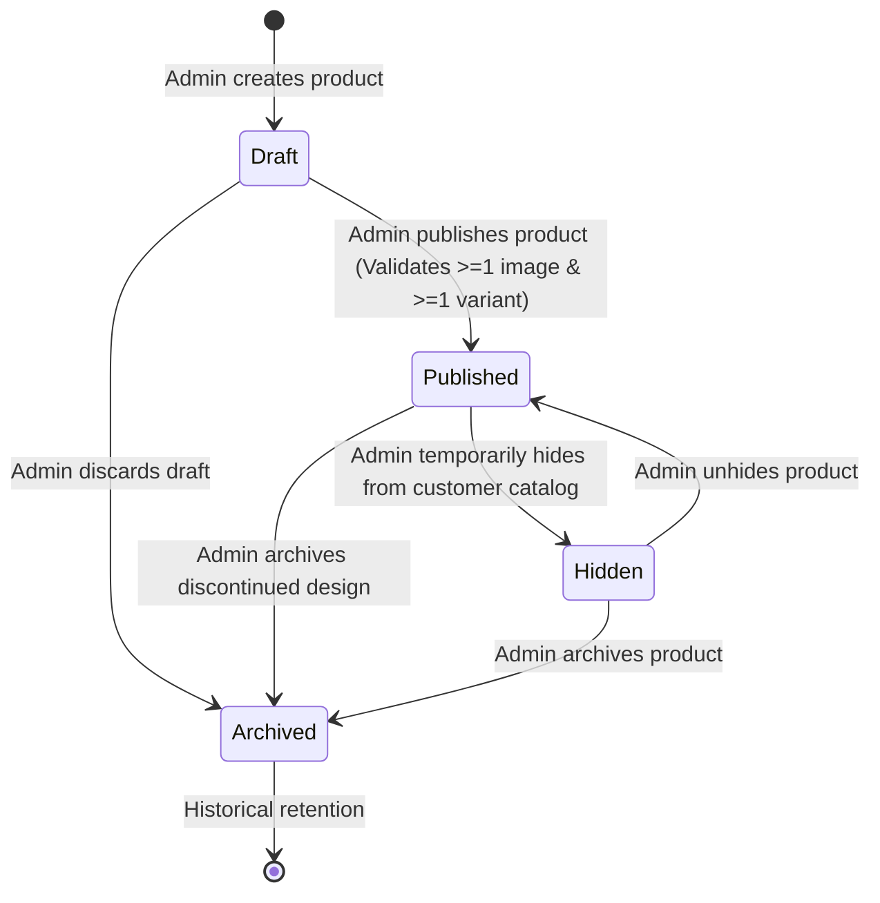
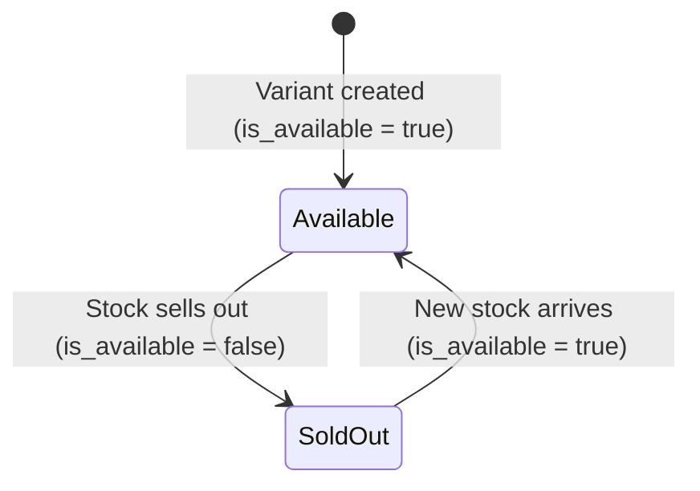

# Domain Specification — KANGAYATH WEB

**Document Version**: 1.0.0  
**Phase**: Phase 02 — Product Requirements & Domain Specification  
**Status**: Authoritative Reference  

---

## 1. Domain Architecture Overview

KANGAYATH WEB is structured into **5 Domain Aggregates**:

```text
┌──────────────────────────────────────────────────────────────────────────┐
│                        KANGAYATH WEB DOMAIN                              │
├────────────────────────────────┬────────────────────────────────────────┤
│ 1. Store Aggregate             │ 2. Catalog & Taxonomy Aggregate         │
│    - StoreProfile              │    - Category                           │
│    - OperatingHoursSchedule    │    - Subcategory                        │
│    - StoreStatus               │                                        │
├────────────────────────────────┼────────────────────────────────────────┤
│ 3. Product & Variant Aggregate │ 4. Merchandising Aggregate              │
│    - Product                   │    - CustomSection                      │
│    - ProductImage              │    - CustomSectionItem                  │
│    - ProductVariant            │                                        │
│    - SizeOption / ColorOption  │                                        │
├────────────────────────────────┴────────────────────────────────────────┤
│ 5. Customer Discovery & Saved Items Aggregate                            │
│    - SavedItemCollection                                                 │
│    - SavedItem                                                           │
└──────────────────────────────────────────────────────────────────────────┘
```

---

## 2. Aggregate Specifications

### 2.1 Aggregate 1: Store & Operations Aggregate

#### Root Entity: `StoreProfile`
Represents the physical shop's canonical business information, public metadata, location coordinates, and communication channels.

| Attribute | Type | Nullable | Description | Invariant / Validation |
| :--- | :--- | :--- | :--- | :--- |
| `id` | UUID | No | Unique store identifier (Singleton in MVP) | Primary Key |
| `name` | String(100) | No | Business name ("Kangayath") | Non-empty, $\le 100$ chars |
| `tagline` | String(255) | Yes | Brand punchline / slogan | Optional |
| `description` | Text | Yes | Extended shop bio / history | Max 2000 chars |
| `primary_phone` | String(20) | No | Landline / Mobile call number | E.164 or Indian 10-digit format |
| `whatsapp_number` | String(20) | No | Direct WhatsApp Business number | Must include country code (`91...`) |
| `address_line1` | String(200) | No | Street address / Building name | Non-empty |
| `address_line2` | String(200) | Yes | Landmark / Suite | Optional |
| `locality` | String(100) | No | Town / Village | Non-empty |
| `panchayat` | String(100) | No | Local administrative Panchayat | Non-empty |
| `district` | String(100) | No | Administrative District | Non-empty |
| `state` | String(100) | No | State (e.g., "Kerala" / "Tamil Nadu") | Default: "Kerala" |
| `pincode` | String(10) | No | Postal PIN code | 6 digits numeric |
| `latitude` | Decimal(9,6) | Yes | GPS Latitude for Google Maps | $-90.0 \le \text{lat} \le 90.0$ |
| `longitude` | Decimal(9,6) | Yes | GPS Longitude for Google Maps | $-180.0 \le \text{long} \le 180.0$ |
| `google_maps_url` | String(500) | Yes | Shareable Google Maps pin link | Valid URL format |

#### Child Entity: `OperatingHoursSchedule`
Represents the weekly regular operating schedule.

| Attribute | Type | Nullable | Description | Invariant / Validation |
| :--- | :--- | :--- | :--- | :--- |
| `id` | UUID | No | Schedule record identifier | Primary Key |
| `store_id` | UUID | No | Reference to parent `StoreProfile` | Foreign Key |
| `day_of_week` | Enum | No | `MONDAY` .. `SUNDAY` (1..7) | Unique per store $(store\_id, day)$ |
| `is_closed` | Boolean | No | Whether the store is closed all day | Default: `false` |
| `open_time` | Time | Yes | Opening time in IST (`HH:MM`) | Required if `is_closed = false` |
| `close_time` | Time | Yes | Closing time in IST (`HH:MM`) | Required if `is_closed = false`, $> open\_time$ |

#### Child Entity: `StoreStatus`
Tracks real-time operational availability with manual overrides.

| Attribute | Type | Nullable | Description | Invariant / Validation |
| :--- | :--- | :--- | :--- | :--- |
| `id` | UUID | No | Status record identifier | Singleton |
| `override_mode` | Enum | No | `AUTO`, `FORCE_OPEN`, `FORCE_CLOSED` | Default: `AUTO` |
| `override_banner` | String(255) | Yes | Custom message displayed on frontend | e.g. "Closed for Onam" |
| `override_until` | DateTime | Yes | Auto-revert timestamp in UTC | Optional |

---

### 2.2 Aggregate 2: Catalog & Taxonomy Aggregate

#### Root Entity: `Category`
Top-level classification representing major departments.

| Attribute | Type | Nullable | Description | Invariant / Validation |
| :--- | :--- | :--- | :--- | :--- |
| `id` | UUID | No | Category identifier | Primary Key |
| `name` | String(100) | No | Display name (e.g., "Men", "Women") | Unique, trimmed, $\le 100$ chars |
| `slug` | String(120) | No | URL identifier (`/category/men`) | Unique, lowercase alphanumeric + dashes |
| `description` | Text | Yes | Short introductory text | Max 500 chars |
| `thumbnail_url` | String(500) | Yes | Category preview image link | Valid URI |
| `display_order` | Integer | No | Sort order on customer navigation | Default: `0`, $\ge 0$ |
| `is_active` | Boolean | No | Visibility toggle | Default: `true` |

#### Child Entity: `Subcategory`
Second-level classification representing specific garment categories.

| Attribute | Type | Nullable | Description | Invariant / Validation |
| :--- | :--- | :--- | :--- | :--- |
| `id` | UUID | No | Subcategory identifier | Primary Key |
| `category_id` | UUID | No | Parent Category reference | Foreign Key, OnDelete: RESTRICT |
| `name` | String(100) | No | Display name (e.g., "Shirts", "Sarees") | Unique per Category $(category\_id, name)$ |
| `slug` | String(120) | No | URL identifier (`/category/men/shirts`)| Unique globally |
| `display_order` | Integer | No | Sort order within parent category | Default: `0`, $\ge 0$ |
| `is_active` | Boolean | No | Visibility toggle | Default: `true` |

---

### 2.3 Aggregate 3: Product & Variant Aggregate

#### Root Entity: `Product`
Represents an individual garment design / model available at the store.

| Attribute | Type | Nullable | Description | Invariant / Validation |
| :--- | :--- | :--- | :--- | :--- |
| `id` | UUID | No | Product identifier | Primary Key |
| `category_id` | UUID | No | Parent category reference | Foreign Key |
| `subcategory_id` | UUID | No | Parent subcategory reference | Foreign Key (Must belong to `category_id`) |
| `name` | String(150) | No | Product name (e.g., "Pure Silk Saree") | Non-empty, $\le 150$ chars |
| `slug` | String(180) | No | Canonical URL slug | Unique, lowercase |
| `description` | Text | Yes | Fabric details, wash care, design | Max 3000 chars |
| `material` | String(100) | Yes | Fabric/material (e.g., "100% Cotton") | Max 100 chars |
| `style_code` | String(50) | Yes | Store internal tag / reference ID | Optional |
| `lifecycle_state` | Enum | No | `DRAFT`, `PUBLISHED`, `HIDDEN`, `ARCHIVED` | Default: `DRAFT` |
| `manual_sold_out` | Boolean | No | Force-override entire product as sold out | Default: `false` |
| `featured` | Boolean | No | Highlight badge flag | Default: `false` |
| `meta_title` | String(100) | Yes | Custom SEO Page Title | Max 100 chars |
| `meta_description`| String(200) | Yes | Custom SEO Meta Description | Max 200 chars |

#### Child Entity: `ProductImage`
Visual assets associated with a product.

| Attribute | Type | Nullable | Description | Invariant / Validation |
| :--- | :--- | :--- | :--- | :--- |
| `id` | UUID | No | Image identifier | Primary Key |
| `product_id` | UUID | No | Parent Product reference | Foreign Key, OnDelete: CASCADE |
| `url` | String(500) | No | Hosted asset URL | Valid URI |
| `alt_text` | String(150) | Yes | Descriptive alt text for accessibility | Max 150 chars |
| `is_primary` | Boolean | No | Primary hero/thumbnail image | Exactly ONE per Product |
| `display_order` | Integer | No | Image gallery sequence | $0 \le \text{order} \le 5$ (Max 6 images) |

#### Controlled Entity: `SizeOption` & `ColorOption`
Standardized attributes for faceted filtering.

- `SizeOption`: `id: UUID`, `name: String(50)` (e.g., "M", "38", "Free Size"), `display_order: Integer`, `category_hint: String`
- `ColorOption`: `id: UUID`, `name: String(50)` (e.g., "Maroon", "Navy Blue"), `hex_code: String(7)` (e.g., `#651714`), `display_order: Integer`

#### Child Entity: `ProductVariant`
The stock and availability unit representing a concrete size/color combination.

| Attribute | Type | Nullable | Description | Invariant / Validation |
| :--- | :--- | :--- | :--- | :--- |
| `id` | UUID | No | Variant identifier | Primary Key |
| `product_id` | UUID | No | Parent Product reference | Foreign Key, OnDelete: CASCADE |
| `size_id` | UUID | Yes | Reference to `SizeOption` | Optional for size-less products |
| `color_id` | UUID | Yes | Reference to `ColorOption` | Optional for color-less products |
| `sku` | String(60) | Yes | Internal barcode / SKU string | Optional |
| `is_available` | Boolean | No | Availability status in shop floor | Default: `true` |

---

### 2.4 Aggregate 4: Merchandising Aggregate

#### Root Entity: `CustomSection`
Dynamic promotional showcase or collection curated by the shop owner.

| Attribute | Type | Nullable | Description | Invariant / Validation |
| :--- | :--- | :--- | :--- | :--- |
| `id` | UUID | No | Section identifier | Primary Key |
| `title` | String(100) | No | Section name (e.g., "Onam Special Offers") | Unique, $\le 100$ chars |
| `slug` | String(120) | No | URL slug (`/sections/onam-special`) | Unique |
| `subtitle` | String(200) | Yes | Promotional caption | Optional |
| `banner_image_url`| String(500) | Yes | Hero banner for collection page | Optional |
| `is_active` | Boolean | No | Visibility toggle on homepage | Default: `true` |
| `display_order` | Integer | No | Ordering on homepage layout | Default: `0`, $\ge 0$ |

#### Child Join Entity: `CustomSectionItem`
Curated association between a Custom Section and a Product.

| Attribute | Type | Nullable | Description | Invariant / Validation |
| :--- | :--- | :--- | :--- | :--- |
| `id` | UUID | No | Item identifier | Primary Key |
| `section_id` | UUID | No | Parent `CustomSection` | Foreign Key, OnDelete: CASCADE |
| `product_id` | UUID | No | Linked `Product` | Foreign Key, OnDelete: CASCADE |
| `sort_order` | Integer | No | Position within the section carousel | Default: `0`, $\ge 0$ |

---

### 2.5 Aggregate 5: Customer Discovery & Saved Items Aggregate

#### Root Entity: `SavedItemCollection`
Server-side collection of products saved by an anonymous customer session.

| Attribute | Type | Nullable | Description | Invariant / Validation |
| :--- | :--- | :--- | :--- | :--- |
| `id` | UUID | No | Collection identifier | Primary Key |
| `session_token` | String(64) | No | Anonymous client cookie/token | Unique indexed token |
| `created_at` | DateTime | No | Creation timestamp (UTC) | Default: `now()` |
| `updated_at` | DateTime | No | Last update timestamp (UTC) | Default: `now()` |

#### Child Entity: `SavedItem`

| Attribute | Type | Nullable | Description | Invariant / Validation |
| :--- | :--- | :--- | :--- | :--- |
| `id` | UUID | No | Record identifier | Primary Key |
| `collection_id` | UUID | No | Parent `SavedItemCollection` | Foreign Key, OnDelete: CASCADE |
| `product_id` | UUID | No | Reference to saved `Product` | Foreign Key, OnDelete: CASCADE |
| `saved_at` | DateTime | No | Timestamp when item was saved | Default: `now()` |

---

## 3. Domain Lifecycles & State Models

### 3.1 Product Lifecycle State Model



### 3.2 Product Variant Availability State Model



### 3.3 Shop Status Calculation State Model

```mermaid
flowchart TD
    Start([Check Shop Status]) --> CheckOverride{Manual Override Configured?}
    CheckOverride -- FORCE_OPEN --> Open[Status: OPEN (Manual Override)]
    CheckOverride -- FORCE_CLOSED --> Closed[Status: CLOSED (Manual Override)]
    CheckOverride -- AUTO --> CheckSchedule{Is Today a Closed Day?}
    CheckSchedule -- Yes --> ClosedSched[Status: CLOSED (Scheduled Off-day)]
    CheckSchedule -- No --> CheckHours{Current IST Time within Open/Close Hours?}
    CheckHours -- Yes --> OpenSched[Status: OPEN (Regular Hours)]
    CheckHours -- No --> ClosedHours[Status: CLOSED (Outside Operating Hours)]
```

---

## 4. Invariants & Business Rules Catalog

### 4.1 Product & Variant Invariants
- **INV-001 (Variant Requirement)**: A `Published` product must possess $\ge 1$ `ProductVariant`.
- **INV-002 (Primary Image Requirement)**: A `Published` product must have exactly 1 `ProductImage` marked `is_primary = true`.
- **INV-003 (Image Upper Limit)**: A product cannot have more than 6 total `ProductImage` records.
- **INV-004 (Variant Uniqueness)**: Within the same `Product`, no two `ProductVariant` records may have identical `(size_id, color_id)` combinations.
- **INV-005 (Subcategory Containment)**: `Product.subcategory_id` must belong to `Product.category_id`.
- **INV-006 (Aggregate Availability)**:
  $$\text{Product.is\_available} \iff (\neg \text{Product.manual\_sold\_out}) \land (\exists v \in \text{Variants} : v.\text{is\_available} = \text{true})$$

### 4.2 Catalog & Taxonomy Invariants
- **INV-007 (Category Deletion Guard)**: A `Category` cannot be deleted if any `Subcategory` or `Product` references it.
- **INV-008 (Subcategory Deletion Guard)**: A `Subcategory` cannot be deleted if any active `Product` references it.
- **INV-009 (Slug Immutability/Uniqueness)**: All slugs (`Category.slug`, `Subcategory.slug`, `Product.slug`, `CustomSection.slug`) must be unique and URL-safe.

### 4.3 Merchandising Invariants
- **INV-010 (Section Item Uniqueness)**: A `Product` can only appear once within a specific `CustomSection` ($(section\_id, product\_id)$ unique).
- **INV-011 (Published Section Guard)**: When rendering a `CustomSection` on the public frontend, products with `lifecycle_state != 'PUBLISHED'` are filtered out.

---

## 5. Deletion & Archival Strategy

| Entity | Action | Mechanism | Referential Integrity Behavior | Justification |
| :--- | :--- | :--- | :--- | :--- |
| **Product** | Archive | Soft (`lifecycle_state = ARCHIVED`) | Retained in DB; removed from public catalog & sections | Preserves customer bookmarks, historical links, and image references. |
| **Product Draft** | Delete | Hard (`DELETE FROM products`) | Cascades to unlinked images & variants | Unpublished drafts have no external references. |
| **Category** | Delete | Restricted (`RESTRICT`) | Blocked if active products or subcategories exist | Prevents accidental orphaned product trees. |
| **ProductVariant** | Delete | Restricted if part of Published | Soft availability toggle (`is_available = false`) preferred | Maintains data integrity for past references. |
| **CustomSection**| Deactivate/Delete | Soft toggle (`is_active = false`) or Hard delete | Cascades to `CustomSectionItem` join records only | Products remain unaffected in the main catalog. |
| **SavedItem** | Remove | Hard delete from collection | Removed from client list | Ephemeral user preference item. |
